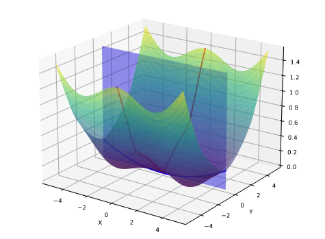

Flat-LoRA: Low-Rank Adaptation over a Flat Loss Landscape
======

# Abstract

* relationship between LoRA optimization space and full parameter space is overlooked

* random perturbation generation strategy for imporved performance and carefully manage memory overhead using random seeds

* experiments: mathematical reasoning, coding abilities, dialogue generation, instruction following, text-to-image generation

# Introduction

LoRA constains optimization to a much lower-dimensional space, and its performance depends on how solutions in this restricted space relate to the full parameter space.

$$\min_{A,B}\max_{\|\varepsilon_W\|_F\leq\rho}L(W+BA+\varepsilon_W)$$

* doubles training cost

* requires storing an additional perturbation 

$$\min_{A,B}\quad\mathbb{E}_{(\varepsilon_W)_{i,j}\sim\mathcal{N}(0,\sigma^2)}\quad L(W+BA+\varepsilon_W)$$

## Effective Random Perturbation Generation

* **Filter structure**: generate weight perturbation by filter. $m$ filters $W^\prime = (W_{1, :}^\prime, W_{2, :}^\prime, W_{3, :}^\prime, \cdots, W_{m, :}^\prime)$

* **Input dimension**: ensure that the variance introduced during the forward pass by random weight perturbation is independent of the input dimension, scale the variance of noise added to each element by a factor of $\frac{1}{n}$, where $n$ is input dimension

$$(\varepsilon_W)_{i,j}\sim\mathcal{N}\left(0,\frac{\sigma^2}{n}\|W_{i,:}^{\prime}\|_2^2\right)$$

# Experiment

* Image Classification

* LLM

  * chat

  * math

  * code

* Text-to-Image Generation (stable diffusion)

* Out-of-Domain Generalization

  * Corruption datasets

  * Instruction following