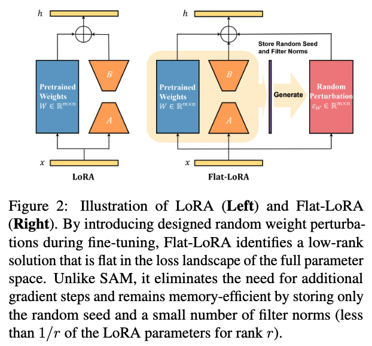

Flat-LoRA: Low-Rank Adaptation over a Flat Loss Landscape
======

# Abstract

* relationship between LoRA optimization space and full parameter space is overlooked

* random perturbation generation strategy for imporved performance and carefully manage memory overhead using random seeds

* experiments: mathematical reasoning, coding abilities, dialogue generation, instruction following, text-to-image generation

# Introduction




LoRA constains optimization to a much lower-dimensional space, and its performance depends on how solutions in this restricted space relate to the full parameter space.

$$\min_{A,B}\max_{\|\varepsilon_W\|_F\leq\rho}L(W+BA+\varepsilon_W)$$

* doubles training cost

* requires storing an additional perturbation 

$$\min_{A,B}\quad\mathbb{E}_{(\varepsilon_W)_{i,j}\sim\mathcal{N}(0,\sigma^2)}\quad L(W+BA+\varepsilon_W)$$

## Effective Random Perturbation Generation

* **Filter structure**: generate weight perturbation by filter. $m$ filters $W^\prime = (W_{1, :}^\prime, W_{2, :}^\prime, W_{3, :}^\prime, \cdots, W_{m, :}^\prime)$

* **Input dimension**: ensure that the variance introduced during the forward pass by random weight perturbation is independent of the input dimension, scale the variance of noise added to each element by a factor of $\frac{1}{n}$, where $n$ is input dimension

$$(\varepsilon_W)_{i,j}\sim\mathcal{N}\left(0,\frac{\sigma^2}{n}\|W_{i,:}^{\prime}\|_2^2\right)$$

# Code

```python
def training_step(self, model: nn.Module, inputs: Dict[str, Union[torch.Tensor, Any]], writter=None):
  model.train()
  inputs = self._prepare_inputs(inputs)

  tot_bz = self.args.per_device_train_batch_size * self.args.n_gpu
  cnt = (len(self.train_dataset) + tot_bz - 1) // tot_bz * self.args.num_train_epochs
  factor = 0.5 * (1 - np.cos(self.gradient_accumulation_counter / cnt * np.pi))

  # generate noise
  if self.rho > 0 and self.gradient_accumulation_counter % (self.T * self.args.gradient_accumulation_steps) == 0:
    self.seed = int(str(time.time()).split('.')[-1])
    torch.manual_seed(self.seed)
    self.filter_norms = []
    _ = 0
    for manual in model.modules():
      if isinstance(module, LoraLinear):
        md = module.weight
        with torch.no_grad():
          data = md.data + module.scaling['default'] * (module.lora_B['default'].weight @ module.lora_A['default'].weight)
          filter_norm = factor * (self.rho + 1e-16) / np.sqrt(data.shape[1]) * torch.norm(data, dim=1, keepdim=True)
          self.filter_norms.append(filter_norm)
          tmp = torch.normal(0, filter_norm.repeat(1, md.shape[1]).view(md.shape))
          md.data += tmp
```

# Experiment

* Image Classification

* LLM

  * chat

  * math

  * code

* Text-to-Image Generation (stable diffusion)

* Out-of-Domain Generalization

  * Corruption datasets

  * Instruction following