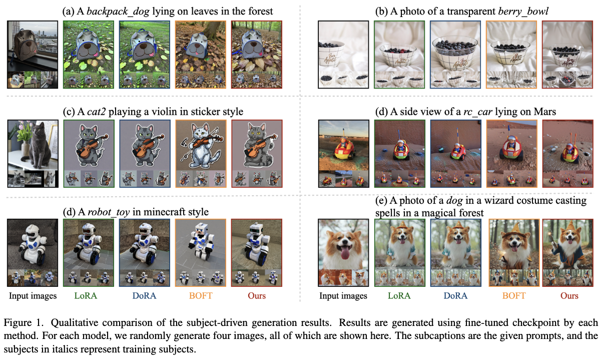

Transformed Low-Rank Adaptation via Tensor Decomposition and Its Applications to Text-to-image Models
======

# Abstract

## Research Background

Approximation gap between low-rank assumption and desired fine-tuning weights prevents the simultaneous acquisition of ultra-parameter efficiency and better performance.

## Reserach Objective

By combining **transform** and **residual adaptations**, to imporve parameter efficiency and performance. 

## Invention points

* **transform**: align pre-trained weights as close as possible to the desired weights

* **residual adaptation**: be effectively appropriated by more compact and parameter-efficient structures

* summarize other PEFT methods using **transform** and **residual adaptation** architecture

## Experiments scope

fine-tune **stable diffusion** models.

# Introduction

* **transform**: apply a linear projection onto pre-trained weights to project it into a space with a lower-rank fine-tuning process. **Tensor-ring matrix format (TRM)** is used here.

* **residual adaptation**: **Tensor-ring decomposition (TR)** is used here.

## Method

## Tensor-Train Matrix Transform Adaptation

Given a matrix $T\in \mathbb{R}^{I \times J}$, $I=\prod_{d=1}^DI_d$, $J=\prod_{d=1}^DJ_d$, TRM factorizes the matrix into contractions of $D$ 4-th order factor $A^d \in \mathbb{R}^{I_d \times J_d \times R_{d} \times R_{d+1}}$, the sequence $[R_1, \cdots, R_{D+1}]$ with $R_{D+1}=R_1$ are called TR rank. Assume $R_1=R_2=\cdots =R_{D+1}$, 

$$\boldsymbol{T}[\overline{i_1\cdots i_D},\overline{j_1\cdots j_D}]=\mathrm{tr}(\mathbf{A}^1[i_1,j_1,:,:]\cdots\mathbf{A}^D[i_D,j_D,:,:])$$

### Initialization of TRM

To ensure that the fine-tuned model is the same as the original model at initialization, the transform $T$ should be an identity matrix:

$$\mathbf{A}^d[:,:,r,r^{\prime}]=\boldsymbol{I}_{I_d}/R,\forall d=1,\ldots,D,\boldsymbol{and}\ r,r^{\prime}=1,\ldots,R$$

Then the resulting $T$ is an identity matrix.

### Constrained transform

sometimes we need to set constraints on the transform matrix, limiting the fine-tuned weight to be within a small region of the pre-trained one.

* Identity regularization: $||T-I_I||_F$

$$\mathcal{R}_I(\mathbf{A}^{1:D})=\sum_{d=1}^D\sum_{r,r^{\prime}=1}^R\left\|\mathbf{A}^d[:,:,r,r^{\prime}]-\boldsymbol{I}_{I_d}/R\right\|_F$$

* Orthogonal regularization: $||TT^T-I_I||_F$

$$\mathcal{R}_{O}(\mathbf{A}^{1:D})= \sum_{d=1}^{D}\sum_{i_{d},j_{d}=1}^{I_{d},I_{d}}\left\|\sum_{l=1}^{I_{d}}(\mathbf{A}^{d}[i_{d},l,:,:]\otimes\mathbf{A}^{d}[j_{d},l,:,:])-\boldsymbol{I}_{R^{2}}/R\right\|_{F}$$

### Matrix Multiplication

the matrix product of two TRM $X=\text{TRM}(A^{1:D})$ and $Y=\text{TRM}(B^{1:D})$ is still a TRM $XY^T=\text{TRM}(C^{1:D})$, where each core tensor satifies $C^d[i_d, j_d, :, :]=\sum_{l_d}\mathbf{A}^d[i_d,l_d,:,:]\otimes\mathbf{B}^d[j_d,l_d,:,:]$

## Tensor-train residual adaptation (tensor-ring decomposition)

expect the resiudal part $\Delta$ to be approximated by very compact structures.

Assume $\Delta \in \mathbb{R}^{I \times J}$, **TR factorizes the matrix into 2D 3rd-order core tensors**, denoted as $B^d\in \mathbb{R}^{I_d \times R \times R}$ and $C^d \in \mathbb{R}^{I_d \times R \times R}$. Each element is computed using the following comtraction:

$$\begin{aligned}
 & \boldsymbol{\Delta}[\overline{i_1\cdots i_D},\overline{j_1\cdots j_D}]= \\
 & \operatorname{tr}(\mathbf{B}^1[i_1,:,:]\cdots\mathbf{B}^D[i_D,:,:]\mathbf{C}^1[j_1,:,:]\cdots\mathbf{C}^D[j_D,:,:])
\end{aligned}$$

### Initialization

